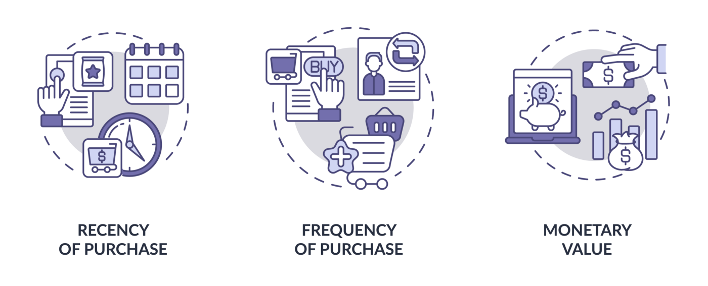
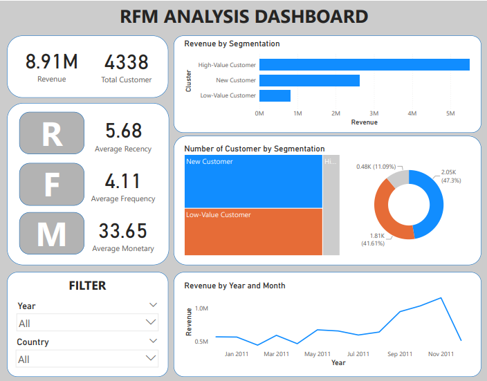

# RFM Analysis with KMeans Clustering and Power BI Visualization

## Project Overview:

### 1. Introdution
This project focuses on performing an RFM (Recency, Frequency, Monetary) analysis to understand customer behavior and segment customers based on their purchasing patterns. The RFM model helps identify key customer segments by calculating three metrics:

- **Recency (R)**: How recently a customer made a purchase.
- **Frequency (F)**: How often a customer makes a purchase.
- **Monetary (M)**: How much revenue a customer generates.

### 2. Methodology:
The RFM analysis will be computed and used as input features for customer segmentation. Using KMeans clustering, we will group customers into distinct segments based on their RFM scores, allowing us to identify categories such as high-value customers, frequent shoppers, and recent buyers.

### 3. Tools and Visualization:

- **Data Processing & Clustering**: The data will be processed and segmented using the KMeans clustering algorithm to discover meaningful customer segments.
- **Visualization with Power BI**: The results will be visualized in Power BI, showcasing dashboards that highlight each customer segment's characteristics, distribution, and behavior patterns. This will enable stakeholders to make informed decisions based on customer insights.

### 4. Objective:
The goal of this project is to provide a clear view of customer segmentation, enhancing the company’s understanding of customer behavior, which can then guide targeted marketing strategies and customer retention efforts.

## Content

Key highlights of the project include:

- **Data Preprocessing**: Clean the data by handling missing, error values. Transform categorical variables, scale numerical features.

- **Model Selection**: Choose appropriate algorithms for credit risk classification, I use KMeans for this.

- **Visualization**: Visualization project on Power BI.

## Implementation

See the details of my project [click here](https://github.com/nguyenanhtuan1102/RFM-Analysis/blob/master/RFM.ipynb)

## Visualization

## Key insights

### **1. Revenue Distribution**

- High-Value Customers contribute a significant majority of the revenue despite being a smaller segment. This segment should be prioritized for retention and loyalty programs, as they are likely to drive sustained revenue.
- Low-Value Customers make up 41.61% of the customer base but contribute minimally to revenue. Strategies to increase their purchase frequency or spend could unlock additional value. For example, targeted promotions or cross-selling opportunities might help in moving some of these customers into a higher-value category.
- New Customers represent 47.3% of the customer base. Engaging these customers early and encouraging repeat purchases could transition them into high-value segments over time. This suggests an opportunity for onboarding campaigns or personalized offers.

### **2. RFM Metrics**

- **Average Recency (5.68)**: The recency score suggests that customers generally make purchases within a relatively short period, showing decent engagement. Increasing engagement frequency can improve customer retention.
- **Average Frequency (4.11)**: An average frequency of just over four purchases per customer suggests moderate engagement. Increasing this frequency, especially among low-value and new customers, could boost revenue.
- **Average Monetary (33.65)**: The monetary score indicates the average spend per customer. There’s potential to increase this by encouraging higher transaction values through bundle offers or premium product recommendations.

### **3. Seasonal Revenue Trends**

The Revenue by Year and Month graph shows peaks in revenue during specific months, likely due to seasonality or marketing campaigns. Leveraging these trends, future campaigns can be planned around these times to maximize sales, potentially using customer segmentation to tailor offers.

### **4. Segmentation Strategy**

- With a clear segmentation in place, marketing efforts can be more targeted:
    - **High-Value Customers**: Retain through loyalty programs, early access to new products, or exclusive discounts.
    - **Low-Value Customers**: Move them up the value ladder with personalized offers, discounts, or incentivized purchases.
    - **New Customers**: Engage them with welcome offers, guides on product usage, and follow-up to encourage repeat purchases.

## Strategic Recommendations

- **Enhance Loyalty Programs**: Focus on High-Value Customers to prevent churn and maintain revenue levels.
Targeted Promotions: For Low-Value Customers, provide targeted offers to increase their purchasing frequency and overall spend.
- **Onboarding and Retention for New Customers**: Implement engagement strategies to transition new customers into repeat buyers.
- **Seasonal Campaigns**: Utilize historical data on revenue peaks to plan promotional campaigns during high-demand periods.
- **Expand Filters and Segmentation**: More granular filters (like age group, purchase category) could provide deeper insights into customer behavior across different demographics.
- These insights suggest that a well-structured, targeted approach focusing on the unique needs of each customer segment can significantly enhance revenue potential and customer loyalty.